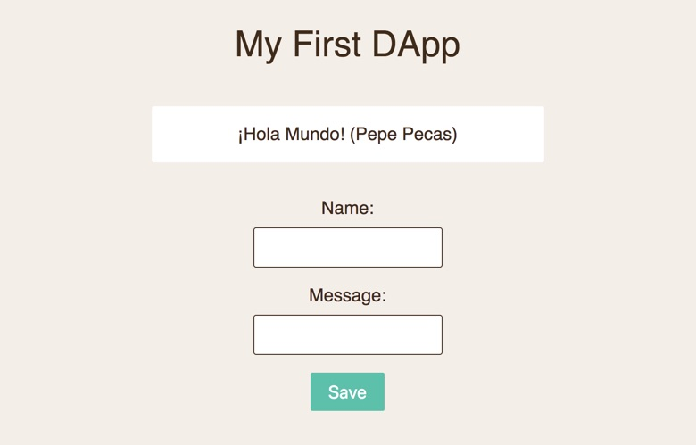

# Mi Primera DApp

> Ejemplo de mi primera DApp usando Remix IDE y Ganache

## Requerimientos

- Descargar e instalar [Ganache](https://truffleframework.com/ganache)

### Desplegar smart contract

Se puede utilizar [Remix IDE](https://remix.ethereum.org) para modificar, compilar y desplegar el smart contract [HelloWorld.sol](contracts/HelloWorld.sol) en el Blockchain personal de Ethereum con Ganache:

1. Ejecutar [Ganache](https://truffleframework.com/ganache).
1. Abrir [Remix IDE](https://remix.ethereum.org).
1. En la tercera columna, en `Compile`, asegurarse de seleccionar la versión `0.4.18+commit.9cf6e910` del compilador de solidity.
1. En la misma columna, ir al separador de `Run`.
1. En environment, seleccionar `Web3 Provider` y asignar el servidor local de Ganache, en mi caso es `http://127.0.0.1:7545`.
1. Haz click en el botón de `Deploy`
1. Si todo salió bien, el contrato debe aparecer en  `Deployed Contracts`, ahí también se pueden probar los métodos del contrato.
1. A un lado del contrato hay un ícono para copiar la dirección del contrato en el porta papeles que será usada en nuestra DApp.
1. El ABI ó *Application Binary Interface* se puede obtener en el separador de `Compile`, ahí hay un icono para copiar el ABI que también será utilizado en nuestra DApp.
